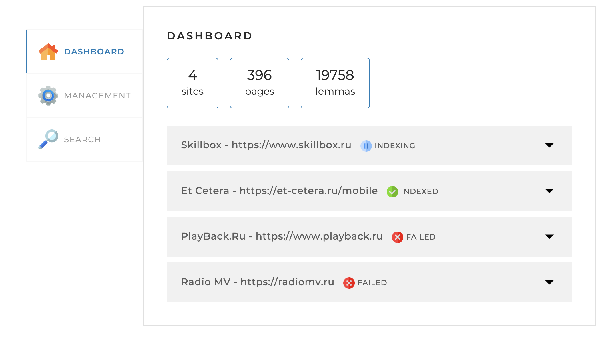
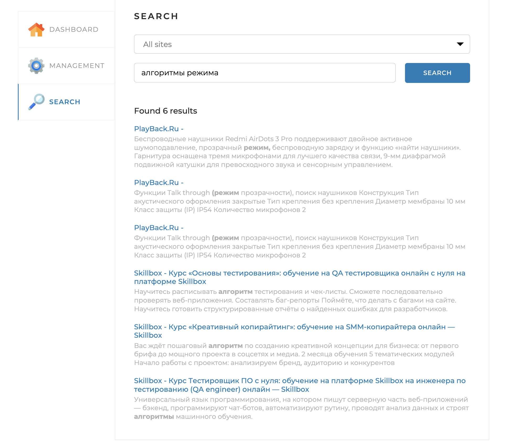

# Site Search Engine

### Description:

Application for making words index of the specified site (or several sites) to enable searching by one or several key
words.

### General logic:

Parses web-site's pages and save the lemmas (normal form of words) from the pages to the DB (mysql)
which gives the ability to search text among the parsed sites after indexing.

### GUI:

The web interface of the application is implemented on one web page with three tabs:

* Dashboard – shows statistics on sites
  dashboard tab
  
* Management – contains indexing tools
  management tab
  
* Search – contains a search field and a drop-down list for selecting a site
  search tab
  

### Technologies and tools:

* Java 19
* Spring Boot 2.7.1
* Maven
* MySQL
* Fork-Join Java Framework
* Apache Lucene Morphology
* JSOUP
* Lombok

### How to launch the application:

* install Java 17+ and MySQL server
* create an empty search_engine database (it's necessary to use utf8mb4 encoding)
* download jar-file and configuration file from Releases
* change the username and password in the configuration file application.yaml for database connection parameters in the
  spring.datasource section
* indicate in the configuration file application.yaml sites for indexing
* start application by running jar from command line: java -jar SearchEngine-1.0.jar
* go to http://localhost:8080/ in the browser

